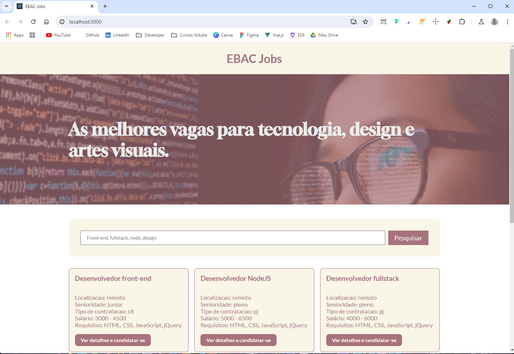

<!-- Banner de Apresentação -->
 
<br>
<br>

<!-- Titulo do Projeto -->

## ✨ EBAC Jobs

<!-- 
<br> -->


_Esse Projeto faz parte do curso de FullStack Python da [EBAC](https://ebaconline.com.br/) ele simula um site de busca de Emprego, Ele foi desenvolvido com **React** e **TypeScript**, sua estillizaçào foi construida com **css-modueles**_

`Task`

- Fazer o clone do Projeto e mudar a sua a Estilizaçào com o uso do **Styled-component**

`Charlenge`

- O Princiapal desáfio foi:

- [x] Entender um projeto, que foi desenvolvido por outra pesssoa, para refatorar a sua estilizaçào, praticando o uso do **styled-component**
<br>

> [!Tip]
> Caso queira ver como ficou o prjeto, siga o passo a passo descrito abaixo.

<!-- Menu -->

## Table of Contents

- [Project description](#-portfólio-github)
- [Setup](#setup)
  - [Prerequisites](#prerequisites)
  - [technologies and tools](#technologies-and-tools)
- [Instalation](#instalation)
- [Usage](#usage)
- [References](#references)
- [Contributors or owners](#contributors-or-owners)
- [Contact](#contact)
- [License](#license)

<!-- Setup do Projeto -->

## Setup

Requisitos necessários para rodar o projeto:<br>

<!-- ### Recommended IDE Setup

[VSCode](https://code.visualstudio.com/) + [Volar](https://marketplace.visualstudio.com/items?itemName=Vue.volar) (and disable Vetur) + [TypeScript Vue Plugin (Volar)](https://marketplace.visualstudio.com/items?itemName=Vue.vscode-typescript-vue-plugin). -->

### Prerequisites

`Node.js` `VSCode` `Git`
> [!IMPORTANT]
>  Run Time [Node.js](https://nodejs.org/en/) com a versão _16 ou superior_.<br>
>  Um editor de códigos, eu recomendo o [VCode](https://code.visualstudio.com/)<br>
>  E o [git](https://git-scm.com/downloads) uma aplicaçào de versionamento de código.

### technologies and tools

`React` `TypeScript` `Vite.js` `Styled-component` `ESLint` `EditorConfig`

<!-- Bagde dos Repositórios, Node.js Git e Vscode -->
<!-- 

 -->

## Instalation

Para rodar esse projeto em seu computador você tera que fazer o [fork](https://docs.github.com/pt/pull-requests/collaborating-with-pull-requests/working-with-forks/fork-a-repo) do repositório. Caso você não saiba como fazer. Estou deixando um **link** para a documentação oficial do gitHub onde é esclarecido como fazer essse processo.<br> Fazendo esse processo você tera uma copia desse Repositório no seu GitHub.
<br>

<a href="https://docs.github.com/pt/pull-requests/collaborating-with-pull-requests/working-with-forks/fork-a-repo"></a>

Depois de ter feito o **fork** vamos fazer o [clone](https://docs.github.com/pt/repositories/creating-and-managing-repositories/cloning-a-repository) desse Repositório atráves do **VSCode**. </br>
Caso você não saiba como fazer, estou deixando um link para a documentação oficial do gitHub onde é esclarecido como fazer essse processo.
<br>
<sub>Command Line</sub>

```bash copy
git clone https://github.com/emmanuelmarcosdeoliveira/to-do_vue_ebac
```


<a href="https://docs.github.com/pt/repositories/creating-and-managing-repositories/cloning-a-repository"></a>

Dentro do nosso **VSCode** vamos abrir o nosso **terminal**. Temos que baixar as dependências do Projeto para o nosso computador para que ele consiga ser Executado:

**1. Instalando as dependências**<br>
<sub>Command Line</sub>

<details>

<summary>Gerenciador de pacotes usado</summary>

**npm**

</details>

<br>


```bash copy
npm install
```

<!-- Bagde das Tecnologias-->

<!-- <div align='left'>


 -->
<br>

## Usage

**2. Inicie o servidor de Desenvolvimento com o seguinte comando dentro do Terminal**<br>
<sub>Command Line</sub>

```bash copy
npm run start
```

</br>

**3. Será aberto uma janela no seu Navegador com o projeto sendo executado.
Caso isso não ocorra digite o endereço abaixo na barra do navegador**


```shell copy
http://localhost:3000
```

 <!-- Imagem de Demostração -->
<h3 align="center"> Imagem de demostração do Projeto

</br>
</br>


</h3>

<!-- Video de Demostraçào -->
 <!-- <h3 align="center">📽️project demonstration video</h3> -->

 <div align="center">
Acesse a versão on-line Projeto clicando no Link Abaixo

<br>
<br>

<a href="https://to-do-vue-xi-pink.vercel.app/">
</a>

</div>
<br>

## References

**Acesse:** [EBAC](https://ebaconline.com.br/)

## Contributors or owners

<br>
@emmanuelmarcosdeoliveira

Designed by EBAC and developed by [Emmanuel Oliveira](https://www.linkedin.com/feed/?trk=homepage-basic_sign-in-submit)
<br>
&copy; Todos os Direitos Reservados

## Contact

<a href ="https://wa.me/5511968336094"></a>
<a href = "mailto:oliveira.devfullstack@gmail.com"></a>
<a href="https://www.linkedin.com/in/oliveira-marcos-emmanuel?lipi=urn%3Ali%3Apage%3Ad_flagship3_profile_view_base_contact_details%3BUetG4s3ZT76Byt3XWdZ2Tg%3D%3D" target="_blank"></a><br>
<sub>😁Obrigado por chegar até aqui!<sub>

## License

<br>
Released in 2024 This project is under the **MIT license**<br>
<br>
<br>

[`voltar ao topo`](#-portfólio-github)
